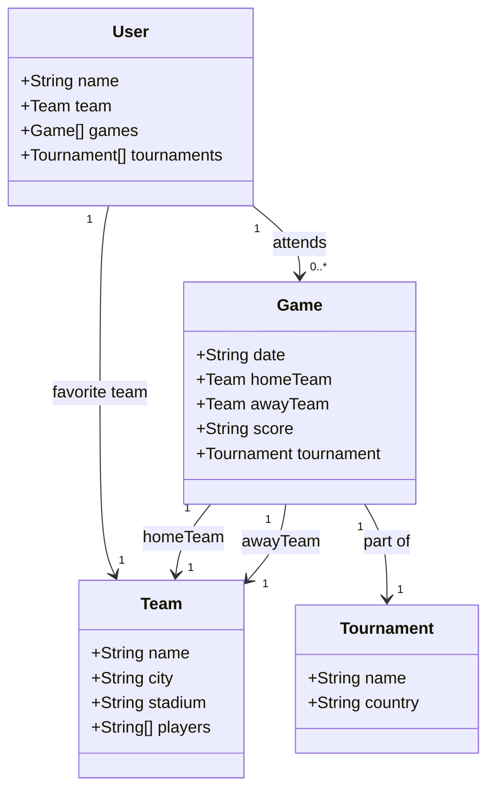

# Claro dev SpringBoot
Java RESTful API criada para finalizar o curso Springboot claro

Uma api criada como exemplo de estudos e com algo que é de meu cotidiano( salvar partidas de futebol que já vi em minha vida, junto de torneios e times), além de oferecer uma classe de time favorito. Esse projeto fez parte do curso de SpringBoot da claro com a plataforma DIO. Essa api está para rodar tanto local como na nuvem usando Railway

