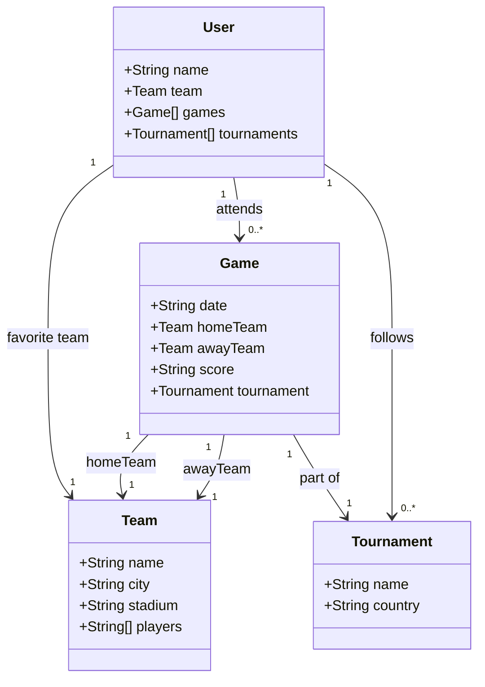

# Claro dev SpringBoot
Java RESTful API criada para finalizar o curso Springboot claro

```mermaid
classDiagram
    class User {
        +String name
        +Team team
        +Game[] games
        +Tournament[] tournaments
    }

    class Team {
        +String name
        +String city
        +String stadium
        +String[] players
    }

    class Game {
        +String date
        +Team homeTeam
        +Team awayTeam
        +String score
        +Tournament tournament
    }

    class Tournament {
        +String name
        +String country
    }

   
    User "1" --> "1" Team : favorite team
    User "1" --> "0..*" Game : attends
    User "1" --> "0..*" Tournament : follows
    Game "1" --> "1" Team : homeTeam
    Game "1" --> "1" Team : awayTeam
    Game "1" --> "1" Tournament : part of
```
